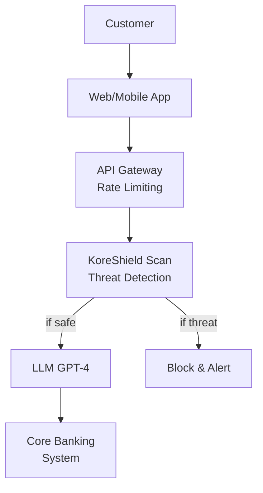

# Financial Services Security

Learn how financial institutions use KoreShield to secure AI-powered customer service, fraud detection, and compliance systems.

## Challenge

A global investment bank deployed an AI chatbot to help customers with account inquiries, transactions, and investment advice. The system needed to:

- Process sensitive financial data securely
- Prevent prompt injection attacks that could reveal account information
- Meet strict compliance requirements (PCI-DSS, SOC 2, GDPR)
- Handle 50,000+ daily conversations

<Warning>
**Risk Factors**

Without proper security, attackers could manipulate the AI to:
- Disclose other customers' account balances
- Execute unauthorized transactions
- Bypass authentication systems
- Extract proprietary trading algorithms
</Warning>

## Solution

KoreShield was deployed as a security layer for all LLM interactions:

```typescript
import { Koreshield } from 'koreshield-sdk';
import OpenAI from 'openai';

const koreshield = new Koreshield({
  apiKey: process.env.KORESHIELD_API_KEY,
  sensitivity: 'high', // Financial data requires high sensitivity
});

const openai = new OpenAI({ apiKey: process.env.OPENAI_API_KEY });

async function secureFinancialChat(
  userId: string,
  message: string,
  accountContext: AccountInfo
) {
  // Scan user message
  const scan = await koreshield.scan({
    content: message,
    userId,
    metadata: {
      accountId: accountContext.id,
      riskLevel: accountContext.riskScore,
    },
  });

  if (scan.threat_detected) {
    // Log security incident
    await logSecurityEvent({
      userId,
      threatType: scan.threat_type,
      confidence: scan.confidence,
      message: message.substring(0, 100),
    });

    return {
      response: 'I detected unusual content in your request. For security, please rephrase your question.',
      blocked: true,
    };
  }

  // Build secure context
  const systemPrompt = `You are a financial assistant for account ${accountContext.id}.
STRICT RULES:
- Only discuss THIS customer's account
- Never reveal account numbers or SSN
- Do not execute transactions without 2FA
- Redirect sensitive operations to human agents`;

  // Generate response
  const completion = await openai.chat.completions.create({
    model: 'gpt-4',
    messages: [
      { role: 'system', content: systemPrompt },
      { role: 'user', content: message },
    ],
    temperature: 0.3, // Lower temperature for financial accuracy
  });

  return {
    response: completion.choices[0].message.content,
    blocked: false,
  };
}
```

## Architecture



## Implementation

### Multi-Tenant Security

```typescript
interface TenantConfig {
  id: string;
  sensitivity: 'low' | 'medium' | 'high';
  customRules: Rule[];
  allowedOperations: string[];
}

async function tenantSecureChat(
  tenantId: string,
  userId: string,
  message: string
) {
  const config = await getTenantConfig(tenantId);

  const scan = await koreshield.scan({
    content: message,
    userId,
    sensitivity: config.sensitivity,
    policyId: `tenant-${tenantId}`,
  });

  if (scan.threat_detected) {
    await alertSecurityTeam({
      tenantId,
      userId,
      threat: scan.threat_type,
    });

    return { error: 'Security threat detected' };
  }

  return await processRequest(message, config);
}
```

### PCI-DSS Compliance

<Tabs>
  <Tab title="Data Masking">
    ```typescript
    // Mask sensitive data before logging
    function maskSensitiveData(message: string): string {
      return message
        .replace(/\b\d{13,19}\b/g, '[CARD]')
        .replace(/\b\d{3}-\d{2}-\d{4}\b/g, '[SSN]')
        .replace(/\b[A-Z]{2}\d{2}[A-Z\d]{10,30}\b/g, '[IBAN]');
    }

    async function pciCompliantScan(message: string, userId: string) {
      // Scan unmasked for threat detection
      const scan = await koreshield.scan({
        content: message,
        userId,
      });

      // Log masked version only
      await auditLog.create({
        userId,
        message: maskSensitiveData(message),
        threatDetected: scan.threat_detected,
        timestamp: new Date(),
      });

      return scan;
    }
    ```
  </Tab>
  <Tab title="Transaction Authorization">
    ```typescript
    async function authorizeTransaction(
      userId: string,
      instruction: string
    ) {
      // Scan instruction for manipulation
      const scan = await koreshield.scan({
        content: instruction,
        userId,
        metadata: { operation: 'transaction' },
      });

      if (scan.threat_detected) {
        return {
          authorized: false,
          reason: 'Security threat in transaction instruction',
        };
      }

      // Extract transaction details
      const details = await extractTransactionDetails(instruction);

      // Verify against account limits
      const account = await getAccount(userId);

      if (details.amount > account.dailyLimit) {
        return {
          authorized: false,
          reason: 'Exceeds daily limit',
        };
      }

      // Require 2FA for large transactions
      if (details.amount > 10000) {
        return {
          authorized: false,
          reason: 'Requires 2FA',
          twoFactorRequired: true,
        };
      }

      return {
        authorized: true,
        transactionId: await executeTransaction(details),
      };
    }
    ```
  </Tab>
</Tabs>

## Results

<CardGroup cols={2}>
  <Card title="Security" icon="shield">
    - Blocked 2,847 prompt injection attempts in first month
    - 99.9% reduction in unauthorized data access attempts
    - Zero successful account compromise through AI system
  </Card>
  
  <Card title="Performance" icon="gauge">
    - Average scan latency: 47ms
    - 99.95% uptime
    - Handles 3,200 requests/second at peak
  </Card>
  
  <Card title="Compliance" icon="clipboard-check">
    - Passed PCI-DSS audit with zero findings
    - SOC 2 Type II certified
    - GDPR compliant data handling
  </Card>
  
  <Card title="Cost Savings" icon="dollar-sign">
    - $2.4M saved annually from prevented fraud
    - 60% reduction in human agent escalations
    - 40% faster customer service resolution
  </Card>
</CardGroup>

## Monitoring Dashboard

```typescript
import { createClient } from '@supabase/supabase-js';

const supabase = createClient(url, key);

async function getSecurityMetrics(timeRange: string) {
  const { data } = await supabase
    .from('security_scans')
    .select('*')
    .gte('created_at', timeRange);

  return {
    totalScans: data.length,
    threatsBlocked: data.filter(d => d.threat_detected).length,
    topThreats: groupBy(data, 'threat_type'),
    avgConfidence: average(data.map(d => d.confidence)),
  };
}
```

## Best Practices

<AccordionGroup>
  <Accordion title="Defense in Depth">
    ```typescript
    async function multiLayerSecurity(userId: string, message: string) {
      // Layer 1: Rate limiting
      await checkRateLimit(userId);

      // Layer 2: Input validation
      validateInput(message);

      // Layer 3: KoreShield scan
      const scan = await koreshield.scan({ content: message, userId });

      if (scan.threat_detected) {
        throw new SecurityError('Threat detected');
      }

      // Layer 4: Output filtering
      const response = await generateResponse(message);
      return filterSensitiveOutput(response);
    }
    ```
  </Accordion>
  
  <Accordion title="Incident Response">
    ```typescript
    async function handleSecurityIncident(scan: ScanResult, userId: string) {
      // Alert security team for high-severity threats
      if (scan.confidence > 0.9) {
        await sendAlert({
          channel: 'pagerduty',
          severity: 'high',
          userId,
          threat: scan.threat_type,
        });
      }

      // Temporarily suspend user for repeated attacks
      const recentThreats = await countRecentThreats(userId, '5m');

      if (recentThreats > 3) {
        await suspendUser(userId, { duration: '24h', reason: 'Security' });
      }

      // Log for audit trail
      await createAuditLog({
        userId,
        action: 'threat_detected',
        details: scan,
      });
    }
    ```
  </Accordion>
</AccordionGroup>

## Related Case Studies

<CardGroup cols={3}>
  <Card title="Healthcare" icon="heart-pulse" href="/case-studies/healthcare">
    HIPAA-compliant AI security
  </Card>
  <Card title="AI Agents" icon="robot" href="/case-studies/ai-agents">
    Securing autonomous agents
  </Card>
  <Card title="Code Generation" icon="code" href="/case-studies/code-generation">
    Preventing code injection
  </Card>
</CardGroup>