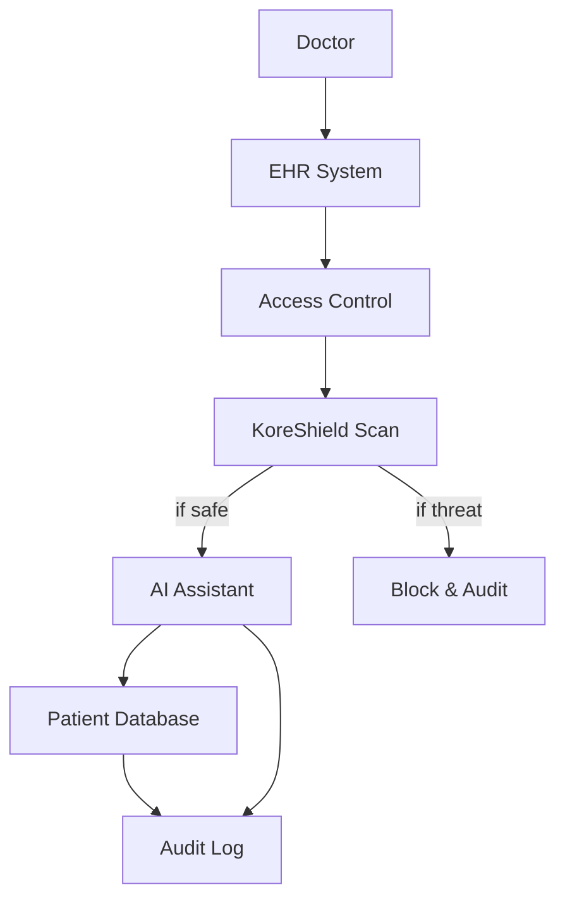

# Healthcare AI Security

How a healthcare provider secured their AI medical assistant while maintaining HIPAA compliance.

## Challenge

A hospital network deployed an AI assistant to help doctors with:
- Patient history summarization
- Differential diagnosis suggestions
- Medical literature references
- Treatment plan recommendations

<Warning>
**Critical Requirements**
- HIPAA compliance for all patient data
- Zero tolerance for data leakage
- High accuracy (medical decisions at stake)
- Audit trail for all AI interactions
</Warning>

## Solution

```typescript
import { Koreshield } from 'koreshield-sdk';
import OpenAI from 'openai';

const koreshield = new Koreshield({
  apiKey: process.env.KORESHIELD_API_KEY,
  sensitivity: 'high',
  complianceMode: 'hipaa',
});

async function secureMedicalQuery(
  doctorId: string,
  patientId: string,
  query: string
) {
  // Scan query for prompt injection
  const scan = await koreshield.scan({
    content: query,
    userId: doctorId,
    metadata: {
      patientId,
      department: 'emergency',
      complianceLevel: 'hipaa',
    },
  });

  if (scan.threat_detected) {
    await auditLog.create({
      doctorId,
      patientId,
      action: 'QUERY_BLOCKED',
      reason: scan.threat_type,
      timestamp: new Date(),
    });

    return {
      error: 'Security threat detected in query',
      auditId: await generateAuditId(),
    };
  }

  // Retrieve patient context with access control
  const patientContext = await getPatientContext(patientId, doctorId);

  // Generate medical response
  const response = await openai.chat.completions.create({
    model: 'gpt-4',
    messages: [
      {
        role: 'system',
        content: `You are a medical AI assistant. 
CRITICAL RULES:
- Only reference THIS patient's data (ID: ${patientId})
- Do not diagnose - provide differential suggestions only
- Always recommend consulting specialists
- Cite medical literature when possible
- Flag contradictions or drug interactions`,
      },
      {
        role: 'user',
        content: `Patient Context:\n${patientContext}\n\nQuery: ${query}`,
      },
    ],
    temperature: 0.2, // Low temperature for medical accuracy
  });

  // Audit successful interaction
  await auditLog.create({
    doctorId,
    patientId,
    action: 'QUERY_PROCESSED',
    queryHash: hashQuery(query),
    timestamp: new Date(),
  });

  return {
    response: response.choices[0].message.content,
    disclaimer: 'AI-generated suggestion. Verify with medical literature.',
  };
}
```

## HIPAA Compliance

### PHI Protection

<Tabs>
  <Tab title="Data Sanitization">
    ```typescript
    // Remove PHI from logs
    function sanitizePHI(text: string): string {
      return text
        .replace(/\b\d{3}-\d{2}-\d{4}\b/g, '[SSN]')
        .replace(/\b[A-Z][a-z]+ [A-Z][a-z]+\b/g, '[NAME]')
        .replace(/\b\d{10}\b/g, '[PHONE]')
        .replace(/\b[\w.-]+@[\w.-]+\.\w+\b/g, '[EMAIL]');
    }

    // Audit all access
    await auditLog.create({
      userId: doctorId,
      action: 'PATIENT_DATA_ACCESS',
      patientId,
      query: sanitizePHI(query),
      ipAddress: req.ip,
      timestamp: new Date(),
    });
    ```
  </Tab>
  
  <Tab title="Access Control">
    ```typescript
    async function getPatientContext(
      patientId: string,
      doctorId: string
    ): Promise<string> {
      // Verify doctor has access to this patient
      const hasAccess = await checkDoctorAccess(doctorId, patientId);
      
      if (!hasAccess) {
        throw new UnauthorizedError(
          'Doctor does not have access to this patient'
        );
      }
      
      // Retrieve only necessary patient data
      const patient = await db.patients.findUnique({
        where: { id: patientId },
        select: {
          age: true,
          gender: true,
          conditions: true,
          medications: true,
          allergies: true,
          // Exclude: name, SSN, address, etc.
        },
      });
      
      return formatPatientContext(patient);
    }
    ```
  </Tab>
  
  <Tab title="Audit Trail">
    ```typescript
    interface AuditLogEntry {
      id: string;
      timestamp: Date;
      userId: string; // Doctor ID
      patientId: string;
      action: 'QUERY_PROCESSED' | 'QUERY_BLOCKED' | 'DATA_ACCESS';
      queryHash: string; // Hash for privacy
      threatType?: string;
      ipAddress: string;
      metadata: Record<string, any>;
    }

    async function createAuditLog(entry: AuditLogEntry) {
      // Store in immutable audit database
      await auditDb.insert(entry);
      
      // Send to SIEM for monitoring
      await siem.log(entry);
      
      // Generate compliance reports
      if (shouldTriggerReport(entry)) {
        await generateComplianceReport(entry);
      }
    }
    ```
  </Tab>
</Tabs>

## Architecture



## Security Layers

<Steps>
  <Step title="Authentication">
    Multi-factor authentication for all medical staff
  </Step>
  <Step title="Authorization">
    Role-based access control (RBAC) - doctors only access assigned patients
  </Step>
  <Step title="Threat Detection">
    KoreShield scans all queries for prompt injection and data exfiltration
  </Step>
  <Step title="Data Minimization">
    AI receives only necessary patient data, never full records
  </Step>
  <Step title="Audit Trail">
    Complete logging of all AI interactions for HIPAA compliance
  </Step>
</Steps>

## Results

<CardGroup cols={2}>
  <Card title="Zero PHI Breaches" icon="shield-check">
    18 months of operation with no data leakage incidents
  </Card>
  
  <Card title="Blocked Attacks" icon="ban">
    487 prompt injection attempts detected and blocked
  </Card>
  
  <Card title="100% Audit Trail" icon="clipboard-check">
    Complete compliance with HIPAA audit requirements
  </Card>
  
  <Card title="Low Latency" icon="bolt">
    &lt;100ms latency for scans with 99.97% uptime
  </Card>
</CardGroup>

## Deployment Checklist

<AccordionGroup>
  <Accordion title="Pre-Deployment">
    - [ ] Complete HIPAA risk assessment
    - [ ] Sign Business Associate Agreement (BAA) with KoreShield
    - [ ] Configure PHI masking in all logs
    - [ ] Set up role-based access control (RBAC)
    - [ ] Establish audit log retention policy (minimum 6 years)
    - [ ] Train staff on AI assistant usage and limitations
  </Accordion>
  
  <Accordion title="Security Configuration">
    - [ ] Enable high sensitivity scanning
    - [ ] Configure HIPAA compliance mode
    - [ ] Set up automated threat alerts
    - [ ] Implement data minimization policies
    - [ ] Configure encryption at rest and in transit
    - [ ] Enable activity monitoring and alerting
  </Accordion>
  
  <Accordion title="Post-Deployment">
    - [ ] Monitor audit logs daily
    - [ ] Review blocked queries weekly
    - [ ] Conduct security assessments quarterly
    - [ ] Update policies based on new threats
    - [ ] Maintain incident response procedures
    - [ ] Generate compliance reports monthly
  </Accordion>
</AccordionGroup>

## Best Practices

<Note>
**Medical AI Safety Guidelines**

1. **Never trust AI for diagnoses** - Use as decision support only
2. **Always verify suggestions** - Cross-reference with medical literature
3. **Maintain human oversight** - Every AI interaction should be reviewed
4. **Log everything** - Complete audit trails are essential for compliance
5. **Minimize data exposure** - Only provide AI with necessary patient context
6. **Regular security reviews** - Threat landscape evolves constantly
</Note>

## Incident Response

```typescript
async function handleMedicalSecurityIncident(
  scan: ScanResult,
  doctorId: string,
  patientId: string
) {
  // Immediate actions
  await Promise.all([
    // Block the query
    logBlockedQuery(scan, doctorId, patientId),
    
    // Alert security team
    sendSecurityAlert({
      severity: 'high',
      type: scan.threat_type,
      doctorId,
      patientId,
    }),
    
    // Notify compliance officer
    notifyComplianceOfficer({
      incident: 'AI_THREAT_DETECTED',
      details: sanitizePHI(scan),
    }),
  ]);
  
  // Investigate if repeated attempts
  const recentAttempts = await countRecentThreats(doctorId, '1h');
  
  if (recentAttempts > 2) {
    // Temporarily revoke AI access
    await revokeAIAccess(doctorId, { duration: '24h' });
    
    // Require security review before restoration
    await createSecurityReviewTicket(doctorId);
  }
}
```

## Related Documentation

<CardGroup cols={3}>
  <Card title="HIPAA Compliance" icon="clipboard-check" href="/compliance/hipaa">
    Complete HIPAA guide
  </Card>
  <Card title="RAG Security" icon="database" href="/advanced/rag-security">
    Secure retrieval systems
  </Card>
  <Card title="Financial Services" icon="building-columns" href="/case-studies/financial-services">
    Similar compliance requirements
  </Card>
</CardGroup>