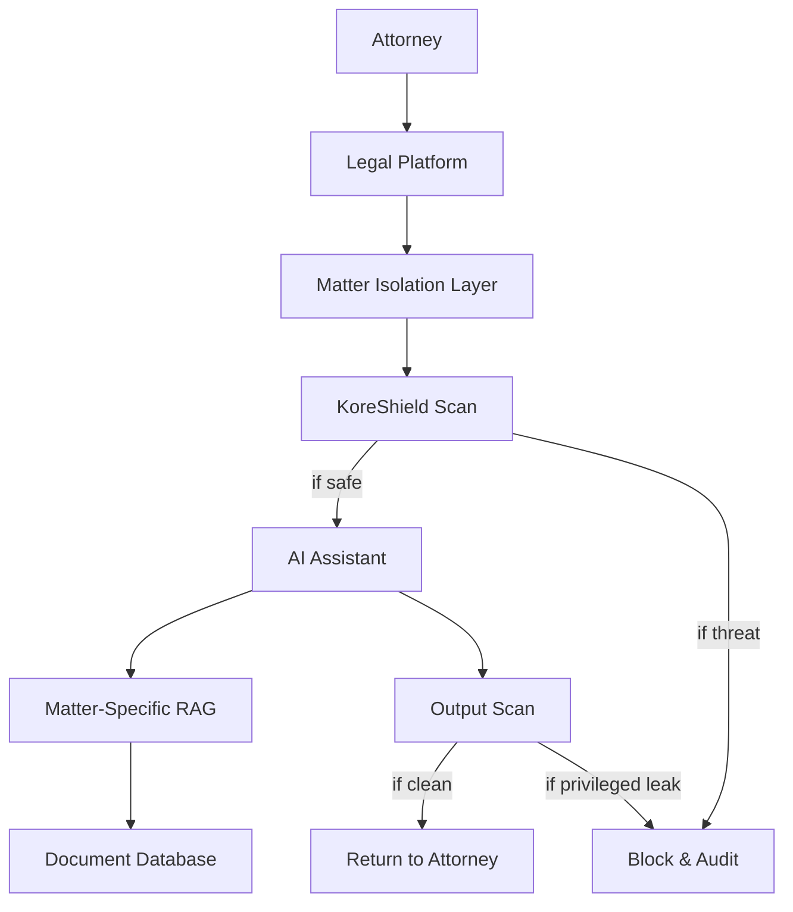

# Legal Tech: Protecting Privilege

How a legal technology provider secured AI-assisted drafting and research while preserving confidentiality.

## Challenge

The platform supported:

- Contract analysis and clause suggestions
- Case law research summaries
- Drafting and redlining assistance

<Warning>
**Critical Requirements**
- Preserve attorney-client privilege and confidentiality
- Isolate case context across firms and matters
- Prevent leakage of confidential facts in outputs
</Warning>

## Solution

KoreShield scanned prompts and outputs with strict policies and enforced per-matter isolation.

```typescript
import { Koreshield } from 'koreshield-sdk';

const koreshield = new Koreshield({
  apiKey: process.env.KORESHIELD_API_KEY,
  sensitivity: 'high',
});

async function secureLegalAssist(userId: string, matterId: string, prompt: string) {
  const scan = await koreshield.scan({
    content: prompt,
    userId,
    metadata: { matterId, domain: 'legal' },
  });

  if (scan.threat_detected) {
    return { error: 'Blocked unsafe legal request' };
  }

  const draft = await generateLegalDraft(prompt);

  const outputScan = await koreshield.scan({
    content: draft,
    metadata: { matterId, output: true },
  });

  if (outputScan.threat_detected) {
    return { error: 'Output failed privilege checks' };
  }

  return { draft };
}
```

## Matter Isolation Strategy

Every request included a matter identifier and tenant boundary:

<CardGroup cols={3}>
  <Card title="Tenant Scoping" icon="building">
    Firm and matter IDs enforced per request
  </Card>
  <Card title="RAG Partitioning" icon="database">
    Retrieval limited to the matter workspace
  </Card>
  <Card title="Token Boundaries" icon="lock">
    Outputs limited to the scoped context
  </Card>
</CardGroup>

## Privilege Controls

<Steps>
  <Step title="Matter Isolation">
    Prompts and retrieved docs scoped per matter - no cross-contamination
  </Step>
  <Step title="PII/Privilege Redaction">
    Removed sensitive entities from logs and audit trails
  </Step>
  <Step title="Audit Trails">
    Every prompt and response recorded for compliance and e-discovery
  </Step>
  <Step title="Human Review">
    High-risk responses queued for attorney approval before use
  </Step>
</Steps>

## Architecture



## Implementation Example

<Tabs>
  <Tab title="Input Scanning">
    ```typescript
    async function scanLegalInput(
      prompt: string,
      userId: string,
      matterId: string
    ) {
      // Scan for prompt injection and data exfiltration
      const scan = await koreshield.scan({
        content: prompt,
        userId,
        metadata: {
          matterId,
          domain: 'legal',
          sensitivity: 'privileged',
        },
      });

      if (scan.threat_detected) {
        await auditLog.create({
          userId,
          matterId,
          action: 'INPUT_BLOCKED',
          threat: scan.threat_type,
          confidence: scan.confidence,
        });

        throw new SecurityError(
          'Request contains potential security threat'
        );
      }

      return scan;
    }
    ```
  </Tab>
  
  <Tab title="Output Scanning">
    ```typescript
    async function scanLegalOutput(
      output: string,
      matterId: string
    ) {
      // Scan for privileged information leakage
      const scan = await koreshield.scan({
        content: output,
        metadata: {
          matterId,
          output: true,
          checkPrivilege: true,
        },
      });

      if (scan.threat_detected) {
        await auditLog.create({
          matterId,
          action: 'OUTPUT_BLOCKED',
          threat: scan.threat_type,
          reason: 'Potential privilege violation',
        });

        throw new PrivilegeViolationError(
          'Output failed privilege checks'
        );
      }

      return scan;
    }
    ```
  </Tab>
  
  <Tab title="Matter Isolation">
    ```typescript
    async function getMatterContext(
      matterId: string,
      userId: string
    ): Promise<MatterContext> {
      // Verify attorney has access to this matter
      const hasAccess = await checkMatterAccess(userId, matterId);
      
      if (!hasAccess) {
        throw new UnauthorizedError(
          'User does not have access to this matter'
        );
      }
      
      // Retrieve only documents for this specific matter
      const documents = await db.documents.findMany({
        where: {
          matterId,
          status: 'active',
        },
        select: {
          id: true,
          content: true,
          metadata: true,
          // Exclude documents from other matters
        },
      });
      
      return {
        matterId,
        documents,
        clientId: await getClientForMatter(matterId),
        jurisdiction: await getJurisdiction(matterId),
      };
    }
    ```
  </Tab>
</Tabs>

## Review and Compliance Workflow

<AccordionGroup>
  <Accordion title="Redaction Checks">
    Flagged privileged entities before output:
    - Client names and identifiers
    - Opposing party information
    - Settlement amounts and terms
    - Attorney work product
    - Strategic legal analysis
  </Accordion>
  
  <Accordion title="Versioning">
    Stored drafts with immutable audit metadata:
    - Document version history
    - Author and timestamp
    - Matter association
    - Review status
    - Approval workflow state
  </Accordion>
  
  <Accordion title="Access Reviews">
    Periodic verification of matter access lists:
    - Quarterly access audits
    - Automated revocation on matter closure
    - Role-based permissions
    - Chinese wall enforcement
  </Accordion>
</AccordionGroup>

## Results

<CardGroup cols={3}>
  <Card title="Privilege Protection" icon="shield-check">
    Reduced risk of privileged data exposure across matters
  </Card>
  <Card title="Output Quality" icon="star">
    Improved consistency of legal output quality
  </Card>
  <Card title="Compliance" icon="clipboard-check">
    Clear compliance posture for enterprise clients
  </Card>
</CardGroup>

## Use Cases

<Tabs>
  <Tab title="Contract Analysis">
    **Secure Clause Review**
    
    ```typescript
    async function analyzeContract(
      contractText: string,
      matterId: string,
      userId: string
    ) {
      // Scan input contract for threats
      await scanLegalInput(contractText, userId, matterId);
      
      // Generate analysis with matter context
      const analysis = await ai.analyze({
        contract: contractText,
        context: await getMatterContext(matterId, userId),
        task: 'identify-risks',
      });
      
      // Scan output for privilege leakage
      await scanLegalOutput(analysis, matterId);
      
      return analysis;
    }
    ```
  </Tab>
  
  <Tab title="Case Research">
    **Isolated Legal Research**
    
    ```typescript
    async function researchCaseLaw(
      query: string,
      matterId: string,
      userId: string
    ) {
      // Scan research query
      await scanLegalInput(query, userId, matterId);
      
      // Retrieve relevant case law (public domain)
      const cases = await legalDatabase.search({
        query,
        jurisdiction: await getJurisdiction(matterId),
        filters: { publicDomain: true },
      });
      
      // Generate summary with citations
      const summary = await ai.summarize(cases);
      
      // Verify no privileged info leaked
      await scanLegalOutput(summary, matterId);
      
      return { summary, citations: cases };
    }
    ```
  </Tab>
  
  <Tab title="Document Drafting">
    **Privileged Document Generation**
    
    ```typescript
    async function draftLegalDocument(
      instructions: string,
      template: string,
      matterId: string,
      userId: string
    ) {
      // Scan instructions and template
      await scanLegalInput(instructions, userId, matterId);
      await scanLegalInput(template, userId, matterId);
      
      // Generate draft with matter-specific context
      const draft = await ai.draft({
        instructions,
        template,
        context: await getMatterContext(matterId, userId),
      });
      
      // Scan output before returning
      await scanLegalOutput(draft, matterId);
      
      // Store with audit trail
      await storeDraft({
        content: draft,
        matterId,
        userId,
        version: await getNextVersion(matterId),
      });
      
      return draft;
    }
    ```
  </Tab>
</Tabs>

## Best Practices

<Note>
**Legal AI Security Principles**

1. **Matter isolation is non-negotiable** - Never mix context across matters
2. **Scan inputs and outputs** - Threats can appear in prompts or generations
3. **Maintain audit trails** - Essential for e-discovery and malpractice defense
4. **Review high-risk outputs** - Human attorney oversight for sensitive matters
5. **Educate users** - Attorneys must understand AI limitations and risks
</Note>

## Lessons Learned

<AccordionGroup>
  <Accordion title="Start Conservative">
    Begin with strict policies and high sensitivity settings. Legal privilege violations can result in malpractice claims and ethical violations. It's better to have false positives than miss a privilege leak.
  </Accordion>
  
  <Accordion title="Clear User Guidelines">
    Attorneys need training on:
    - What the AI can and cannot do
    - How to phrase requests safely
    - When to escalate to human review
    - Ethical obligations when using AI
  </Accordion>
  
  <Accordion title="Regular Audits">
    Conduct monthly reviews of:
    - Blocked requests (false positives?)
    - Access patterns (unusual activity?)
    - Output quality (hallucinations?)
    - Compliance metrics (audit ready?)
  </Accordion>
</AccordionGroup>

## Related Documentation

<CardGroup cols={3}>
  <Card title="Security" icon="shield" href="/features/security-policies">
    Core security features
  </Card>
  <Card title="Configuration" icon="gear" href="/configuration">
    Policy configuration
  </Card>
  <Card title="Monitoring" icon="chart-line" href="/integrations/monitoring">
    Alerts and dashboards
  </Card>
</CardGroup>